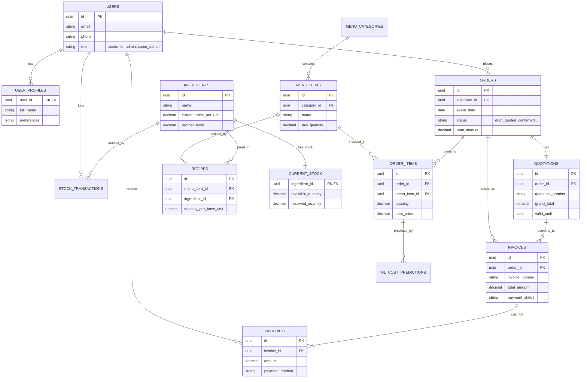

# Database Schema ERD

Based on `src/database/migrations/001_initial_schema.sql`.

```mermaid
erDiagram
    USERS ||--o{ USER_PROFILES : "has"
    USERS ||--o{ ORDERS : "places"
    USERS ||--o{ STOCK_TRANSACTIONS : "logs"
    USERS ||--o{ PAYMENTS : "records"

    MENU_CATEGORIES ||--o{ MENU_ITEMS : "contains"

    MENU_ITEMS ||--o{ ORDER_ITEMS : "included_in"
    MENU_ITEMS ||--o{ RECIPES : "defined_by"

    INGREDIENTS ||--o{ RECIPES : "used_in"
    INGREDIENTS ||--o{ STOCK_TRANSACTIONS : "tracked_by"
    INGREDIENTS ||--|| CURRENT_STOCK : "has_stock"

    ORDERS ||--o{ ORDER_ITEMS : "contains"
    ORDERS ||--|| QUOTATIONS : "has"
    ORDERS ||--o{ INVOICES : "billed_via"

    QUOTATIONS ||--o{ INVOICES : "converts_to"

    INVOICES ||--o{ PAYMENTS : "paid_by"

    ORDER_ITEMS ||--o{ ML_COST_PREDICTIONS : "predicted_by"

    USERS {
        uuid id PK
        string email
        string phone
        string role "customer, admin, super_admin"
    }

    USER_PROFILES {
        uuid user_id PK, FK
        string full_name
        jsonb preferences
    }

    MENU_ITEMS {
        uuid id PK
        uuid category_id FK
        string name
        decimal min_quantity
    }

    INGREDIENTS {
        uuid id PK
        string name
        decimal current_price_per_unit
        decimal reorder_level
    }

    RECIPES {
        uuid id PK
        uuid menu_item_id FK
        uuid ingredient_id FK
        decimal quantity_per_base_unit
    }

    CURRENT_STOCK {
        uuid ingredient_id PK, FK
        decimal available_quantity
        decimal reserved_quantity
    }

    ORDERS {
        uuid id PK
        uuid customer_id FK
        date event_date
        string status "draft, quoted, confirmed..."
        decimal total_amount
    }

    ORDER_ITEMS {
        uuid id PK
        uuid order_id FK
        uuid menu_item_id FK
        decimal quantity
        decimal total_price
    }

    QUOTATIONS {
        uuid id PK
        uuid order_id FK
        string quotation_number
        decimal grand_total
        date valid_until
    }

    INVOICES {
        uuid id PK
        uuid order_id FK
        string invoice_number
        decimal total_amount
        string payment_status
    }

    PAYMENTS {
        uuid id PK
        uuid invoice_id FK
        decimal amount
        string payment_method
    }
```
