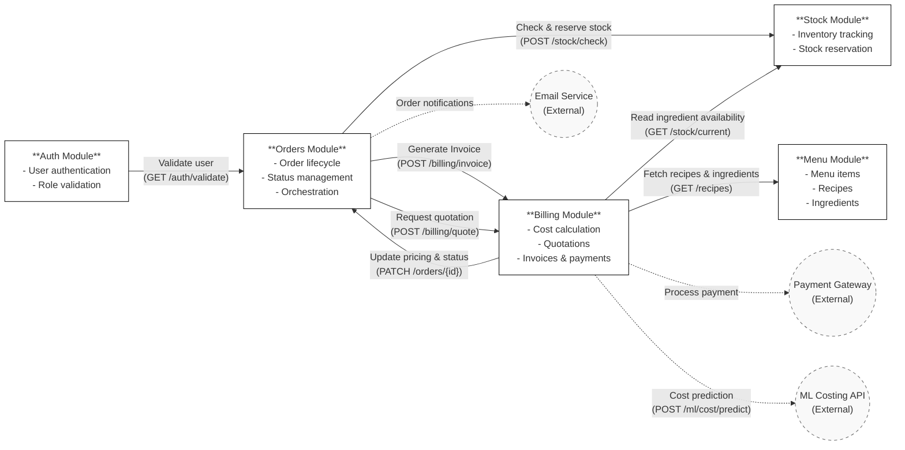

# System Integration Map
*By Mugilan S S*

## Phase 1: Onboarding

### Purpose
To understand system architecture, module responsibilities, inter-module dependencies, and external integrations.

### High-Level System Overview
The system consists of multiple backend modules supporting customer ordering, pricing, inventory management, and billing. These modules communicate through well-defined APIs and share data via a centralized database.

**Primary Modules:**
* Auth
* Menu
* Orders
* Billing
* Stock
* Payments (part of Billing)

**External Services:**
* ML Costing API
* Payment Gateway
* Email Notification Service

## Module Responsibilities

### 1. Auth Module
**Purpose:** User management and security

**Responsibilities:**
* User registration and login
* Role management (customer, admin, super_admin)
* Authentication and authorization

**Owned Tables:**
* `USERS`
* `USER_PROFILES`

**Dependencies:**
* Referenced by Orders, Payments, and Stock modules for user identity

### 2. Menu Module
**Purpose:** Define what can be ordered

**Responsibilities:**
* Menu categories and items
* Recipe definitions
* Ingredient base data

**Owned Tables:**
* `MENU_CATEGORIES`
* `MENU_ITEMS`
* `RECIPES`
* `INGREDIENTS`

**Dependencies:**
* Billing module (for cost calculation)
* Stock module (for inventory usage)

### 3. Orders Module
**Purpose:** Manage the order lifecycle

**Responsibilities:**
* Order creation and updates
* Order status management
* Order items tracking

**Owned Tables:**
* `ORDERS`
* `ORDER_ITEMS`

**Dependencies:**
* Auth module (customer identity)
* Billing module (quotation and invoice generation)
* Stock module (availability validation and reservation)
* Email service (order notifications)

### 4. Billing Module
**Purpose:** Pricing, quotation, invoicing, and payments

**Responsibilities:**
* Cost calculation
* Quotation generation
* Invoice creation
* Payment tracking

**Owned Tables:**
* `QUOTATIONS`
* `INVOICES`
* `PAYMENTS`
* `ML_COST_PREDICTIONS`

**Dependencies:**
* Orders module (order data)
* Menu module (recipe and ingredient data)
* External ML Costing API
* Payment gateway

### 5. Stock Module
**Purpose:** Inventory management

**Responsibilities:**
* Track ingredient stock levels
* Reserve stock for confirmed orders
* Log stock movements

**Owned Tables:**
* `CURRENT_STOCK`
* `STOCK_TRANSACTIONS`

**Dependencies:**
* Orders module (order confirmation)
* Menu module (ingredient definitions)

## Inter-Module Dependencies

| From Module | To Module | Purpose |
| :--- | :--- | :--- |
| Orders | Auth | Identify customer placing order |
| Orders | Billing | Generate quotation and invoice |
| Orders | Stock | Validate and reserve inventory |
| Billing | Menu | Fetch recipe and ingredient data |
| Billing | Stock | Read ingredient availability |
| Billing | Orders | Update order pricing and status |
| Stock | Orders | Reflect stock reservation status |

## External Service Integrations

| External Service | Called By | Purpose |
| :--- | :--- | :--- |
| ML Costing API | Billing Module | Predict dynamic ingredient and order costs |
| Payment Gateway | Billing Module | Process online payments |
| Email Service | Orders Module | Send order and payment notifications |

## Dependency Diagram
Dependency diagram showing all API calls between modules:

## Integration Flow Summary

### Key Observations
* Each module owns its core tables but may read from other modules.
* Pricing data is stored at order-item level to preserve historical accuracy.
* Stock reservation prevents overbooking for future events.
* External services are isolated within Billing and Orders modules to avoid tight coupling.
